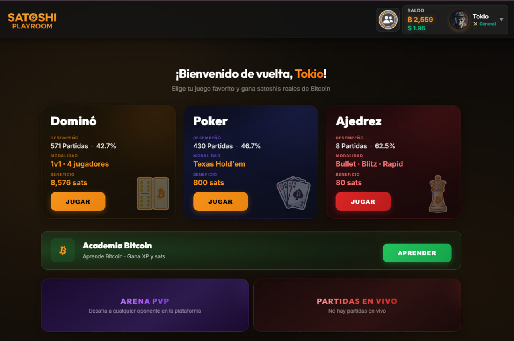
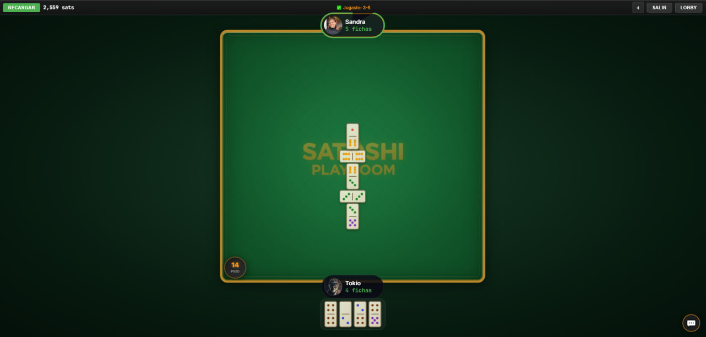
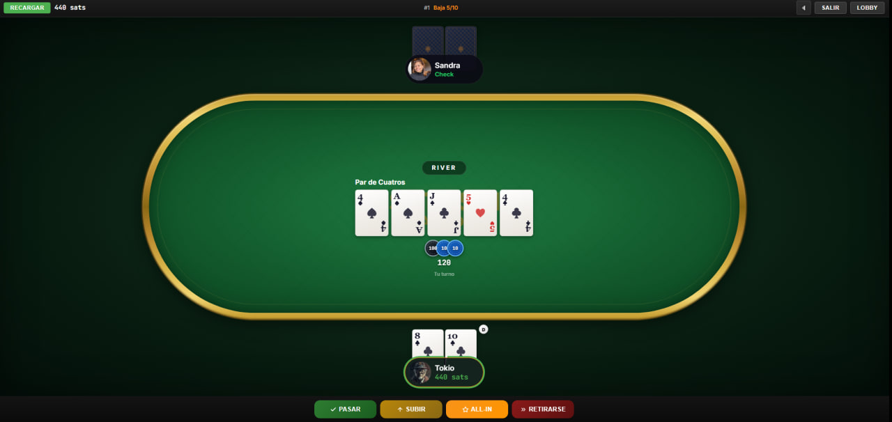
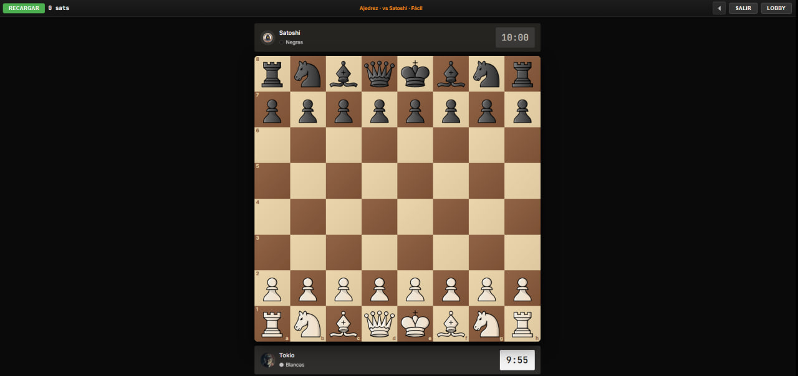
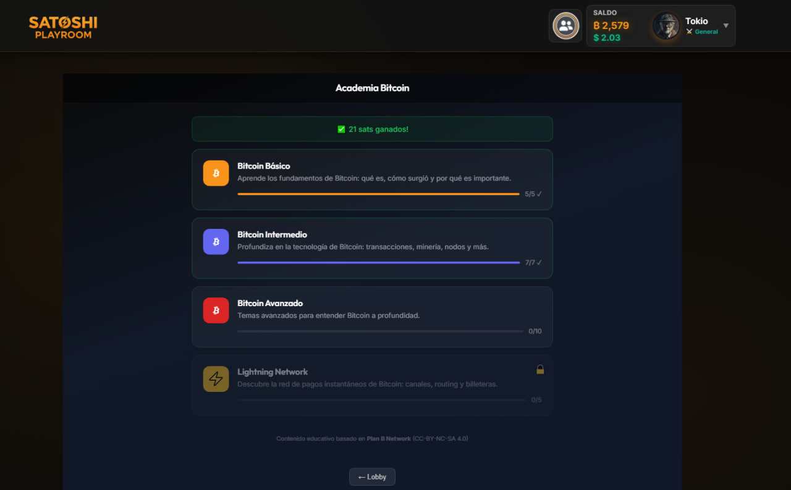
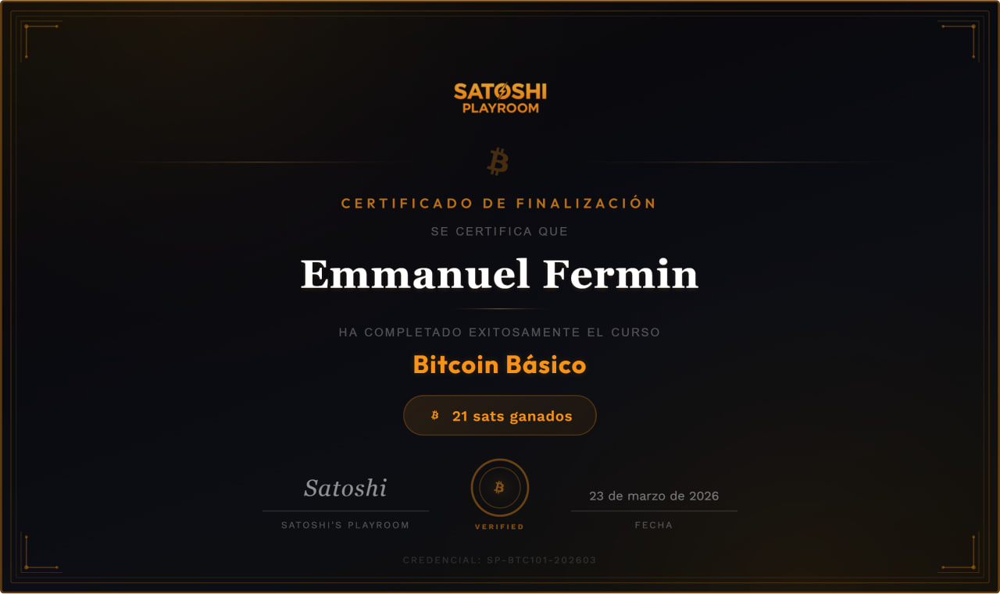
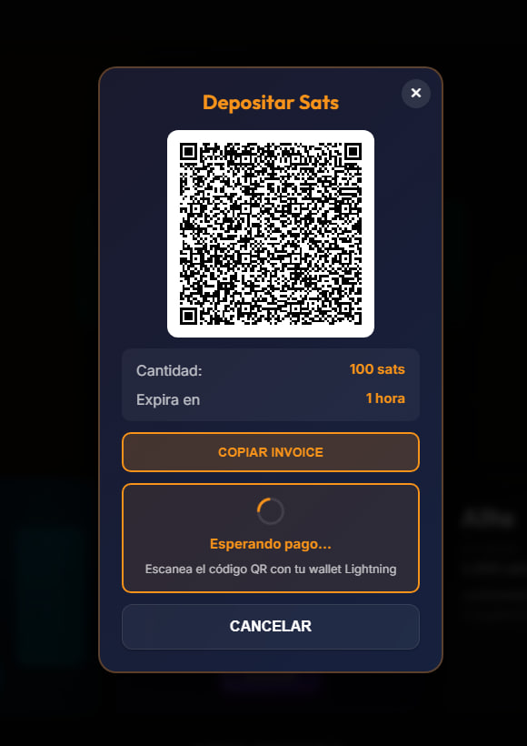
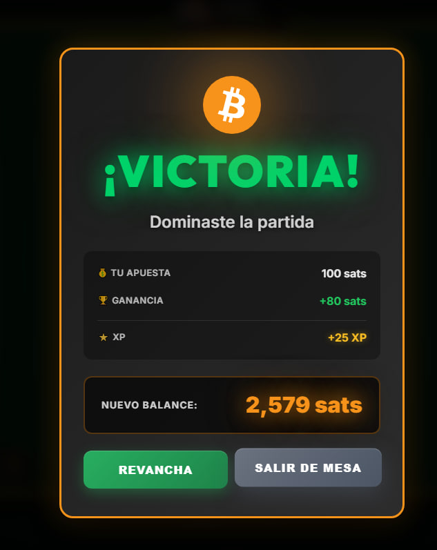

# Satoshi's Playroom

### Bitcoin gaming platform. Classic games, real sats, instant payouts.

Domino · Poker · Chess · Bitcoin Academy

---

## What is this?

**Satoshi's Playroom** is a real-time, real-money multiplayer gaming platform where players bet Bitcoin satoshis on Domino, Texas Hold'em Poker, and Chess. Every game settles instantly via the **Lightning Network**, and the platform doubles as a learning environment with the built-in **Bitcoin Academy** that rewards players with real sats for completing courses.

This repository is a **showcase**, a living portfolio of the project's design, architecture, and engineering decisions. The source code lives in a private repository.

> 🌐 **Live product:** [satoshiplayroom.com](https://www.satoshiplayroom.com) · ⚡ Lightning-native · 🌎 Made for Bitcoin Latam

---

## The Games

### 🀫 Domino: 1v1 and 4-player

Classic Latin American domino with real-time multiplayer, automatic boneyard handling, tranque detection, and PvP betting from low to high stakes.

- **Modes:** 1v1 head-to-head and 4-player team format
- **Smart timers:** 32-second turn timer with auto-play on disconnect
- **Server-side authority:** all game logic lives on the server. Clients only render.
- **Tile customization:** multiple skins (classic, neon, wooden)

---

### 🃏 Poker: Texas Hold'em cash tables

Multi-table cash poker with proper hand engine, side pots, position rotation, and persistent sessions across multiple hands.

- **Stake levels:** Low (5/10), Medium (10/20), High (50/100), plus private tables
- **Up to 6 seats** per table with full position logic (BTN/SB/BB/UTG/MP/CO)
- **Hand engine:** custom Texas Hold'em evaluator with side pot calculation
- **Anti-cheat by architecture:** hole cards never exist on the client until showdown
- **Mobile-optimized UI:** separate mobile board for sub-1024px touch devices

---

### ♟️ Chess: Bullet, Blitz, Rapid

Real-time chess with three time controls plus an offline mode against Satoshi (Stockfish WASM in-browser).

- **Time controls:** Bullet 1+0, Blitz 5+0, Rapid 10+0, plus configurable private tables
- **vs Satoshi:** local Stockfish WASM with 3 difficulty levels (Easy / Medium / Hard)
- **Custom Maestro pieces** with a wood palette designed in-house
- **Full clock logic** including flag-fall, increment, and pause-on-disconnect

---

### 🎓 Bitcoin Academy: Learn and earn

Built-in educational platform with structured Bitcoin courses. Players earn XP and a one-time **21 sats reward** for completing any course with a passing grade.

- **4 courses:** Bitcoin Basics, Intermediate, Advanced, and Lightning Network
- **Quiz-based progression** with instant feedback
- **Content based on Plan B Network** (CC-BY-NC-SA 4.0)

#### Verifiable diploma on completion

Every graduate receives a custom-designed diploma with a unique credential ID, generated client-side via SVG and exportable as PNG. The credential ID encodes course and date (`SP-BTC101-202603`) for verifiability. It's not just a certificate, it's a record.

---

## Lightning-native economy

Every deposit and withdrawal goes through the **Lightning Network** via the Blink API. No on-chain delays, no centralized custodian gimmicks, just instant sats.

| | |
|:---:|:---:|
|  |  |
| **Deposit:** scan a Lightning invoice, get credited in seconds | **Win:** payouts settle the moment a hand ends |

- **Deposits:** invoice generation + automatic payment polling
- **Withdrawals:** atomic balance verification + Blink payout
- **Recovery system:** scans pending and expired invoices on every server restart and credits any settled payments
- **Rake:** transparent 10% on PvP games, separated from house liquidity

---

## Tech Stack

### Frontend
- **React 18** + **Vite**: single-page app with code-split game chunks
- **Socket.IO client**: real-time game events
- **Firebase Auth**: email/password + Google sign-in
- **i18n**: full Spanish/English support
- **Driver.js**: interactive onboarding tours
- **Mobile-first**: separate mobile boards for poker and domino

### Backend
- **Node.js + Express**: REST endpoints for wallet and admin
- **Socket.IO server**: all game state and events
- **Firebase Admin SDK**: Firestore for users, balances, history
- **FCM**: push notifications for challenges and turn reminders
- **Blink Lightning API**: GraphQL client for deposits and withdrawals
- **Stockfish WASM**: chess AI shipped to the browser

### Infrastructure
- **Easypanel**: Docker-based deployment (frontend + backend as separate services)
- **Firebase**: auth, Firestore, FCM
- **Custom domain** + HTTPS via Let's Encrypt

---

## Engineering Highlights

These are the architectural decisions that make a real-money multiplayer platform actually work.

### 🛡️ Server-side authority (anti-cheat by architecture)
The server owns every piece of game state. Clients send **intents** (`I want to bet 100`) and receive **state updates** (`the pot is now 500`). Hole cards in poker do not exist in the client until `phase === 'showdown'`. There is no client-side game logic to exploit because there is no client-side game logic.

### 🔐 Cryptographic randomness
All security-sensitive randomness (deck shuffling, invite codes, IDs) uses Node's `crypto.randomInt` via a custom `secureRandomInt()` helper with rejection sampling, instead of `Math.random()`. The deck is shuffled with Fisher-Yates using cryptographically-strong entropy.

### 💸 Atomic payment flows
Every balance mutation runs inside a Firestore transaction. Funds are **locked before** a game starts, never optimistically credited. If a Blink withdrawal fails after balance deduction, a refund transaction runs immediately. There is no code path where sats can vanish.

### 🔄 Cross-game protection
A user cannot play poker and domino simultaneously. Bidirectional locks (`isUidAtTable` ↔ `isUserInChallengeGame`) are enforced via dependency injection. Cleanup runs on every exit path (cashout, disconnect, table destruction).

### 📡 Real-time architecture
- Per-socket and per-UID rate limiting (15 events/sec, 30 events/sec respectively) to prevent multi-tab bypass
- Sequential event processing per room (never parallel) to eliminate race conditions
- 60-second ghost seat eviction as a safety net against zombie sessions
- Full state re-sync from server on every reconnection. Clients never trust local state.

### ♻️ Recovery systems
- **Deposit recovery:** scans all pending and expired invoices against Blink on every server start and credits any settled payments
- **Game payout retries:** Firestore writes retry up to 3× with exponential backoff
- **State corruption detection:** if game state becomes internally inconsistent, the game ends and all locked funds are refunded equally

### 🎯 Mobile-first design
Detected via a `useIsMobile()` hook (≤1024px + touch). Poker and domino each have a dedicated mobile board component, not a responsive squeeze. Action bars are touch-optimized with adequate spacing for thumb taps.

---

## Social Layer

The platform is more than just games. It's a community.

- **Online presence:** see who's online and which game they're in, in real time
- **Friends system:** add, accept, block, with persistent Firestore storage
- **Direct challenges:** challenge a specific friend to a game with custom stakes
- **Spectator mode:** watch live games (with sanitized state, no hidden info leaks)
- **Push notifications:** FCM-powered alerts for challenges and turn reminders
- **Per-game lobby counts:** real-time player counts per game type, broadcast every 5 seconds

---

## Admin Dashboard

A purpose-built admin panel surfaces revenue, activity, graduates, and risk signals.

- **KPIs:** total rake, daily active users, education graduates, deposit and withdrawal flows
- **Per-game rake separation:** domino, poker, chess tracked independently
- **Education incentive tracking:** sats paid to academy graduates subtracted from house profit
- **Server-side caching:** 5-minute TTL on dashboard reads to minimize Firestore quota usage
- **Modal "Ver todo":** full scrollable lists for graduates and PvP games

---

## About the build

A solo project by [@tokiopy](https://github.com/tokiopy). Every architectural decision, security boundary, and line of code on this platform reflects one engineer's judgment.

The platform handles real money in production. Every architectural decision in this README is in place because the alternative would mean lost user funds.

**Project span:** 2025 → ongoing
**Status:** Live in production at [satoshiplayroom.com](https://www.satoshiplayroom.com)

---

## Other projects

If you like this work, check out other things I've built:

- **Federación** *(coming soon)*
- **Satoshi Somos Todos** *(coming soon)*
- **Kabra Coin** *(coming soon)*

---

## Connect

- 🌐 **Live game:** [satoshiplayroom.com](https://www.satoshiplayroom.com)
- 💬 **GitHub:** [@tokiopy](https://github.com/tokiopy)
- 📧 **Email:** info@tokiohub.com

---

## License

This showcase repository (text and screenshots) is released under the MIT License. The underlying source code is **proprietary** and not open-source.

---

**From Tokio With ⚡**

